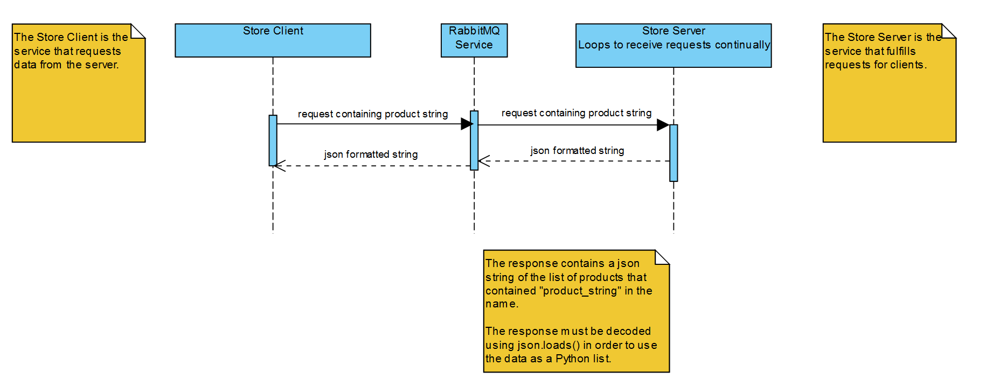

# Using This Service

## Requirements

> RabbitMQ is installed: [Download Here](https://www.rabbitmq.com/download.html)

> RabbitMQ Service is Running

## Requesting Data

### Imports

> pika - RabbitMQ library for Python

> json - Used for parsing requested data

> uuid - Used for generating randomized unique ids for requests

### Client Class Code

Services wishing to request data can use the example code below to get started.

```python
class StoreClient:

    def __init__(self):
        # localhost can be replaced with address of different machine if desired
        self.connection = pika.BlockingConnection(pika.ConnectionParameters("localhost"))
        self.channel = self.connection.channel()
        # queue name must be "store_data_request" to receive data
        self.store_data_request_queue = self.channel.queue_declare(queue="store_data_request")

        self.callback_queue = self.store_data_request_queue.method.queue

        self.channel.basic_consume(
            queue=self.callback_queue,
            on_message_callback=self.response_callback,
            auto_ack=True
        )

        self.response = None
        self.correlation_id = None

    def response_callback(self, ch, method, properties, body):
        if self.correlation_id == properties.correlation_id:
            self.response = body.decode()

    def call(self, product_str):
        self.response = ""
        self.correlation_id = str(uuid.uuid4())
        self.channel.basic_publish(exchange="",
                                   routing_key="store_data_request",
                                   properties=pika.BasicProperties(reply_to=self.callback_queue,
                                                                   correlation_id=self.correlation_id),
                                   body=product_str)
        self.connection.process_data_events(time_limit=None)
        return self.response
```

### Requesting data using this class

If the client wants to request all products containing the string "apple", they can request the data like so:

```python
store_client = StoreClient()
response = store_client.call("apple")
json_str = json.loads(response)
```

The response contains the data from the request as a json formatted string.

Use ```json.loads(response)``` to parse the response into a usable Python list format.

### UML Diagram for Usage


